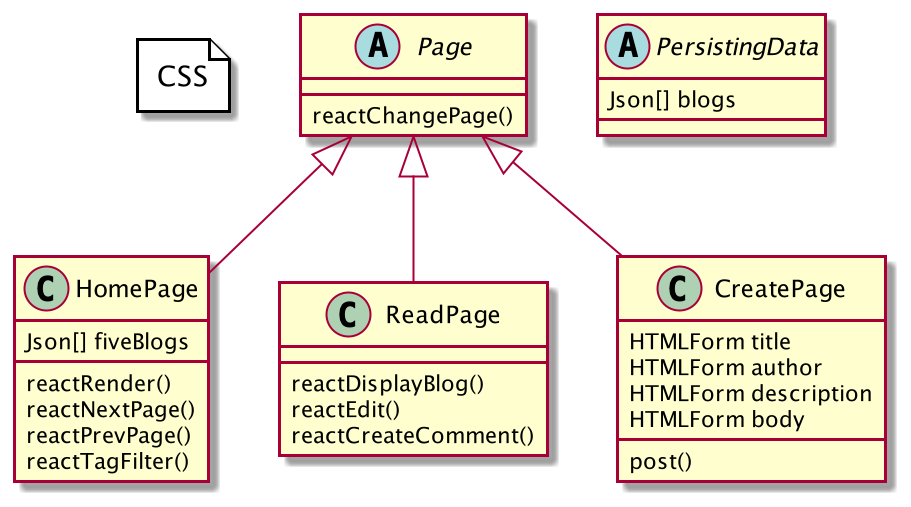
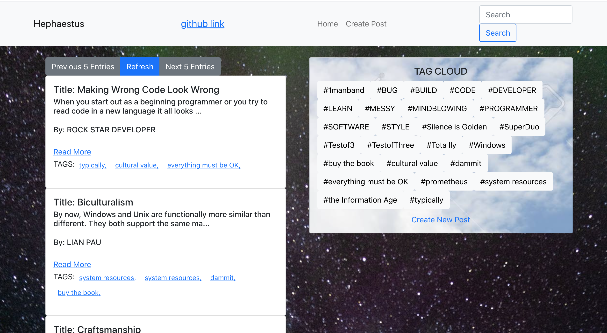
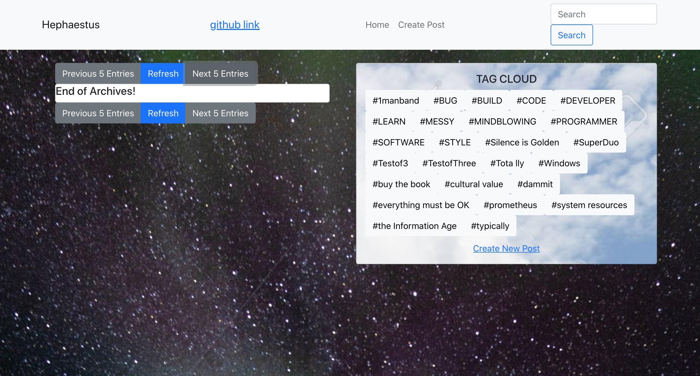
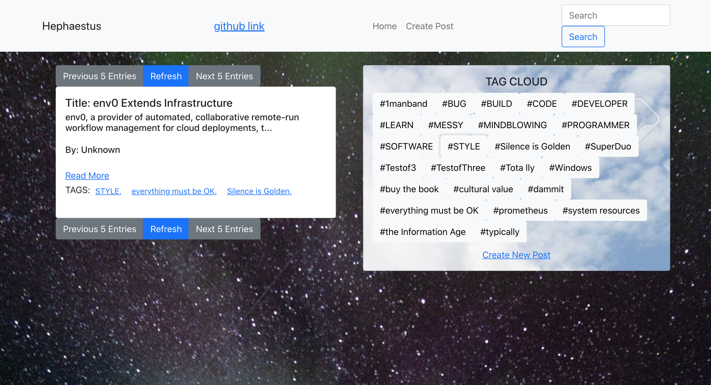
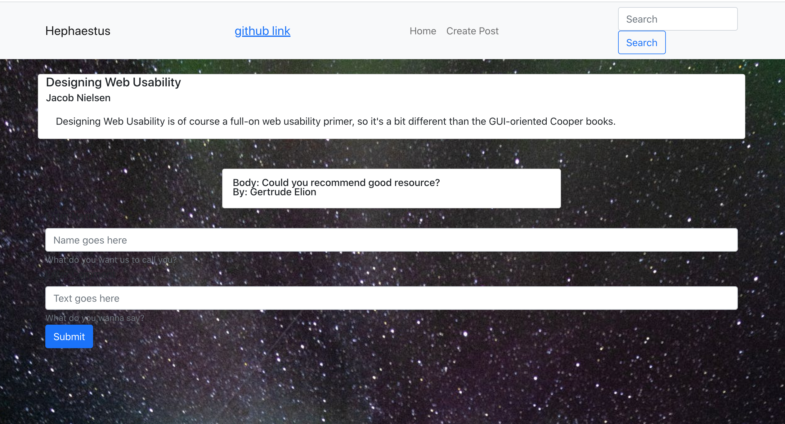

<span style="color:">
Contributors: Abiel Figueroa (@Abielf), Monali Khandelwal (@Monali-Khandelwal), Hazel Becker (@hazelbecker), Lena Litouka (@CodeHere21)


#Hephaestus
##Blog Application


#####Table of Contents
1. About The Project
 	* Tech Stack
2. Getting Started
	* Prerequisites
	* Installation
 
3. Documentation

###About The Project
	
Hephaestus is a blog application, which allows the user to publish a post, display the date that the post was published, and assigned a specific author assigned to the post and read different post blogs which are available on the website. These web-based services also allow users to tag content with specific categories, making it easier to search for all posts on topic within the blog. One of the best features is commenting, allows users to comment on a website, below blog post. 

#####Tech Stack
* Wireframe - Figma (www.figma.com)
* Frontend - React
* Business Logic - Java
* Data Layer - H2
* Cloud - Heroku

###Getting Started

Make sure you have IntelliJ Ultimate or any other IDE which supports programming in Java and React. 
#####Prerequisities
To get a local copy up and running please save 2 repositories on your local machine. 

```
git clone [address repository]
```
For example

```
git clone https://github.com/Abielf/hephaestus-backend.git
```
Source code for backend can be find at
[Hephaestus-backend](https://github.com/Abielf/hephaestus-backend.git)

Frontend can be find at [Hephaestus-frontend](https://github.com/Abielf/Haphaestus-frontend.git)

#####Installation
This project was bootstrapped with Create React App.

Available Scripts
In the project directory, you can run:

```
npm start
```
Runs the app in the development mode.
Open http://localhost:3000 to view it in the browser.

The page will reload if you make edits.
You will also see any lint errors in the console.

```
npm test
```
Launches the test runner in the interactive watch mode.
See the section about running tests for more information.

```
npm run build
```
Builds the app for production to the build folder.
It correctly bundles React in production mode and optimizes the build for the best performance.

The build is minified and the filenames include the hashes.
Your app is ready to be deployed!

See the section about deployment for more information.

```
npm run eject
```
Note: this is a one-way operation. Once you eject, you can’t go back!

If you aren’t satisfied with the build tool and configuration choices, you can eject at any time. This command will remove the single build dependency from your project.

Instead, it will copy all the configuration files and the transitive dependencies (webpack, Babel, ESLint, etc) right into your project so you have full control over them. All of the commands except eject will still work, but they will point to the copied scripts so you can tweak them. At this point you’re on your own.

You don’t have to ever use eject. The curated feature set is suitable for small and middle deployments, and you shouldn’t feel obligated to use this feature. However we understand that this tool wouldn’t be useful if you couldn’t customize it when you are ready for it.

#####Learn More
You can learn more in the Create React App documentation.

To learn React, check out the React documentation.

#####Code Splitting
This section has moved here: [https://facebook.github.io/create-react-app/docs/code-splitting](https://facebook.github.io/create-react-app/docs/code-splitting)

Analyzing the Bundle Size
This section has moved here: [https://facebook.github.io/create-react-app/docs/analyzing-the-bundle-size](https://facebook.github.io/create-react-app/docs/analyzing-the-bundle-size)

Making a Progressive Web App
This section has moved here: [https://facebook.github.io/create-react-app/docs/making-a-progressive-web-app](https://facebook.github.io/create-react-app/docs/making-a-progressive-web-app)

Advanced Configuration
This section has moved here: [https://facebook.github.io/create-react-app/docs/advanced-configuration](https://facebook.github.io/create-react-app/docs/advanced-configuration)

Deployment
This section has moved here: [https://facebook.github.io/create-react-app/docs/deployment](https://facebook.github.io/create-react-app/docs/deployment)

```
npm run build fails to minify
```
This section has moved here: [https://facebook.github.io/create-react-app/docs/troubleshooting#npm-run-build-fails-to-minify](https://facebook.github.io/create-react-app/docs/troubleshooting#npm-run-build-fails-to-minify)

###Documentation

[Click Here](https://www.figma.com/file/sd5BzKWQp2X7qvBgYUd8FF/Untitled?node-id=9%3A21) - to find wireframe of the project, it shows the placement of elements in a user interface and demonstrate the intended layout and functionality of a solution. 

#####UML Diagram


#####User Interface
######Homepage


######Last page


######Search by tag


######Comment box


